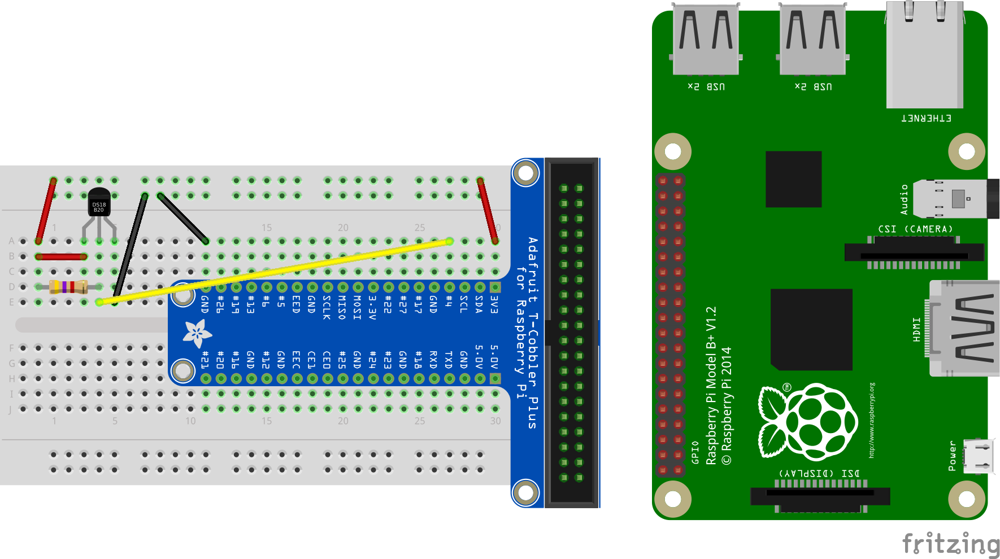

# Capteur température DS18B20

Mise en œuvre du DS18B20 avec Raspberry Pi et Python

## Capteur température 1-Wire

Mise en oeuvre du Dallas DS18B20.

Documentation technique du [capteur](https://datasheets.maximintegrated.com/en/ds/DS18B20.pdf)

Aperçu:

  * capteur numérique
  * utilisation sur un [bus 1-Wire](https://fr.wikipedia.org/wiki/1-Wire)

## Montage et branchement du capteur



## Configuration Raspberry Pi

Couche basse du noyau GNU/Linux: configuration1-wire 

```bash
# installer le logiciel de test et les modules
$ sudo apt install python3-w1thermsensor

# ajouter les deux modules de gestion du 1 wire: w1-therm, w1-gpio
$ sudo vi /etc/modules
w1-therm
w1-gpio pullup=1
...
```

Tester le montage:
```bash
$ w1thermsensor ls
Found 1 sensors:
  1. HWID: 0000082a1f01 Type: DS18B20
```

## Programmation Python

Création et activation d'un environnement python virtuel:

```bash
$ python3 -m venv ds18b20
$ cd ds18b20
$ source bin/activate
(ds18b20) $ 
```

Installation des dépendances:

```bash
(ds18b20) $ pip3 install -r requirements.txt
Collecting ds18b20==0.1.3 (from -r requirements.txt (line 1))
  Downloading https://files.pythonhosted.org/packages/d1/37/1e295dcb583cf01e9842f5ac36b85f132bd6c3c2d3c9aa0e9f70ff90b657/ds18b20-0.01.03.tar.gz
Installing collected packages: ds18b20
  Running setup.py install for ds18b20 ... done
Successfully installed ds18b20-0.1.3
(ds18b20) $
```

Utilisation du ds18b20, récupération et affichage de la température par le programme *prog_ds18b20.py*:

```python
from ds18b20 import DS18B20

sensor = DS18B20()
temperature_celsius = sensor.get_temperature()
print("température=",temperature_celsius)
```

```bash
# démarrer le programme 
(ds18b20) $ python3 prog_ds18b20.py
température= 85.0
```

Désactivation de l'environnement python virtuel:

```bash
(ds18b20) $ deactivate
$
```

## Références

  * https://github.com/rgbkrk/ds18b20
  * https://github.com/timofurrer/w1thermsensor
  * https://www.framboise314.fr/mesure-de-temperature-1-wire-ds18b20-avec-le-raspberry-pi/
  * http://espace-raspberry-francais.fr/Composants/Sonde-de-temperature-DS18B20-sur-Raspberry-Francais/

